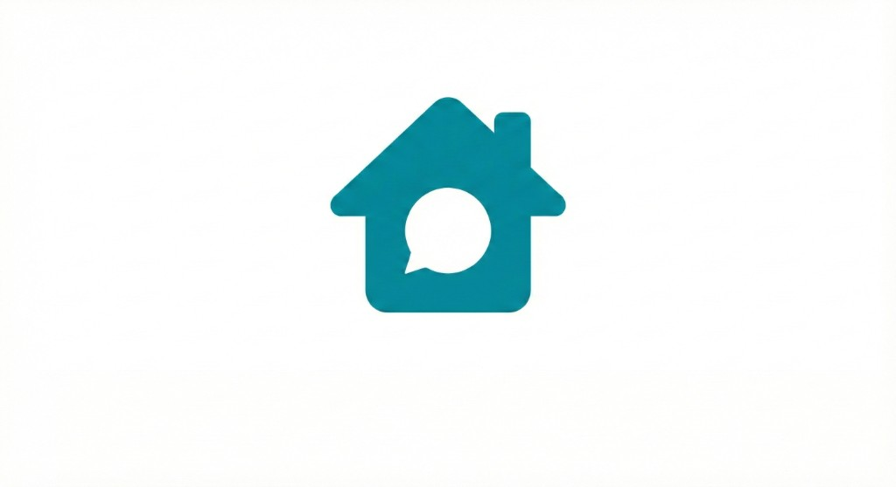

<p align="center">
  
</p>

<h1 align="center">Cul-de-Chat</h1>

<p align="center">
  <strong>A modern digital town square for bringing local communities together.</strong>
</p>

Cul-de-Chat is a free, open-source, non-commercial app for **one place at a time** — an apartment building, townhome complex, HOA, dorm, or similar community. It gives neighbors a private, invite-only space to know each other, coordinate, and build real local connection.

It is meant to replace the messy mix of building group chats, HOA email, and city-scale social apps with something smaller and more trusted: a shared feed and boards, a resident directory, private messages, and light admin tools — owned and run by the community, not monetized with ads or engagement ranking.

**Who it’s for:** residents first. An admin (or steward) invites people in and keeps membership tidy; success is neighbors actually using it to meet, help, and show up for each other.

**What it’s not:** a global social network, a Nextdoor clone, or property-management software. One instance serves one community. No cross-community feed. No ads.

---

### Product docs
- Vision & mission: [docs/vision.md](docs/vision.md)
- Feature backlog: [docs/feature-backlog.md](docs/feature-backlog.md)
- Non-goals: [docs/non-goals.md](docs/non-goals.md)
- Competitive landscape: [docs/competitive-landscape.md](docs/competitive-landscape.md)
- Design direction: [docs/design-direction.md](docs/design-direction.md)
- Admin guide (stub): [docs/admin-guide.md](docs/admin-guide.md)

### What’s in today
- **Boards & square feed** — interest boards; chronological feed across the community
- **Posts, comments, reactions** — open discussion inside the walls
- **Admin bulletins** — pinned announcements
- **Directory** — opt-in neighbor listing by name/unit (hidden residents still reachable by unit)
- **Direct messages** — private 1:1 messaging between neighbors

### Core tech
- **Backend**: Go (Gin)
- **API**: REST (+ Socket.IO planned for real-time)
- **Database**: PostgreSQL
- **Frontend**: React Native (Expo, in `mobile/`)
- **Deployment**: Docker

### Specifications
Authoritative, living specs are kept in `.cursor/rules/`:
- [Functional Requirements Specification](.cursor/rules/functional-spec.md)
- [Technical Requirements Specification](.cursor/rules/technical-spec.md)
- [API & Data Specifications](.cursor/rules/api-data-spec.md)
- [UI Screens Specification](.cursor/rules/ui-screens.md)
- [Engineering backlog](docs/backlog.md)

Generated HTTP docs (Swagger UI) are served at `/api/docs/index.html` when `CULDECHAT_DOCS=true`. Regenerate with `make docs` after changing handlers.

### Local development
```bash
docker compose -f infra/dev/docker-compose.yml up --build
cd mobile && npx expo start --web
make test
```

Local admin: `admin@culdechat.local` / `changeme123`. Seed fake residents with `make seed` (same password). The Expo web app talks to the API at `http://127.0.0.1:8080/api` (override with `EXPO_PUBLIC_API_URL`).

Postgres and the API bind to localhost only. The compose stack bootstraps a local admin (`admin@culdechat.local` / `changeme123`) and allows the local JWT secret via `CULDECHAT_ALLOW_INSECURE_JWT=true`. Invite emails are caught by Mailpit at [http://127.0.0.1:8025](http://127.0.0.1:8025) unless you put real SMTP settings in gitignored `infra/dev/.env` (`SMTP_HOST`, `SMTP_PORT`, `SMTP_FROM`, `SMTP_USER`, `SMTP_PASS`, `SMTP_STARTTLS=true`). Branding artwork lives in `assets/branding/logo.jpg`.

Optional TLS (needs a real hostname):

```bash
CULDECHAT_DOMAIN=your.domain docker compose -f infra/dev/docker-compose.yml --profile tls up --build
```

### Operations
- HTTPS (Let's Encrypt), JWT auth, bcrypt for password hashing.
- Logs via Promtail/Loki/Grafana; daily PostgreSQL backups recommended.

### License
See [LICENSE](./LICENSE).
